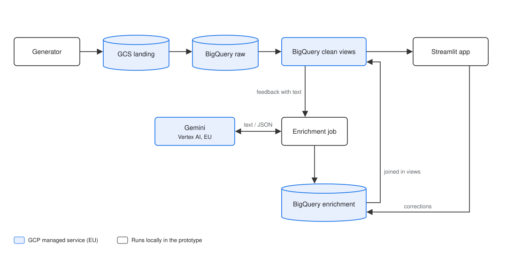

# SPEC — Aura Wear Feedback Workbench (prototype)

GCP project `aura-feedback-workbench-510309` · All resources in EU.

This spec describes **the prototype to build**. Agents read this file plus the `SPEC.md` of the component they work on. Any change to a decision is committed together with the code that requires it.

## 1. Context

Aura Wear, a contemporary clothing brand, is building an Intelligent Customer Feedback Workbench. It receives customer feedback daily from several channels. Product teams want to understand it alongside purchase data. This prototype covers two feedback channels, web store star ratings and support chat transcripts about returns or defects, plus a daily orders export.

**Users.** Product managers, business teams (internal, a handful of people).

**Central question.** "What are customers complaining about, on which products, and are these complaints driving returns?"

## 2. Goals, non-goals, success criteria

**Goals**
- G1. Load daily files for web ratings, support chats and orders from Cloud Storage into BigQuery raw tables (Data Ingestion).
- G2. Build clean views that unify the two feedback sources and link them to orders (Data Modeling & Storage).
- G3. Enrich every feedback item that has text with an LLM: category, sentiment, one-sentence summary; store the output in BigQuery (LLM Enrichment).
- G4. A single-screen Streamlit workbench: search, filter and open feedback items; original text side by side with the AI summary and tags; correct a tag; re-run summaries for selected items (Interactive Visualization).

**Non-goals (do not build):** other feedback channels, aggregated dashboards, scheduling, deployment, monitoring, streaming, authentication, dbt, CI/CD, an LLM accuracy eval.

**Assumptions and simplifications**

| Item | Drives |
|---|---|
| Thousands of feedback items per day, not millions | Clean layer as views; one LLM call per item |
| Each source delivers one file per day, and daily freshness is enough | Daily batch with load jobs; no streaming |
| One order = one product and one customer | Product and customer resolved through the order |
| An order has at most one rating and at most one chat | Simpler generator; no view depends on it |
| Every feedback item references an order in the orders export | No orphan handling needed |
| Feedback is in English only | No language detection; one prompt |
| A chat transcript is a single text | No nested structures in BigQuery |
| A single orders file with only the fields the workbench needs | No separate customers or products tables |
| Every text gets a summary, not only long comments | One uniform LLM output for all items |

## 3. Architecture

Components communicate only through BigQuery tables and views, never by
calling each other, with one exception: the app calls the enrichment
function to re-run summaries.

**Components**

| Component | Folder | Reads | Writes | Technology |
|---|---|---|---|---|
| Data generator | `data_gen/` | — | local files | Python |
| Loader | `ingestion/` | local files | GCS, `raw.*` | Python, Storage and BigQuery clients |
| Clean layer | `sql/` | `raw.*`, `enrichment.*` | defines `clean.*` views and the empty `enrichment.*` tables | BigQuery SQL |
| Enrichment | `enrichment/` | `clean.feedback`, `enrichment.feedback_enrichment` | `enrichment.feedback_enrichment` | Python, `google-genai`, Pydantic |
| Workbench | `app/` | `clean.feedback_workbench` | `enrichment.feedback_corrections`; re-runs via the enrichment function | Streamlit |

**Run order** (all manual in the prototype)
1. Once: create the bucket and datasets; apply the SQL (enrichment tables, then views).
2. Per day: generate → load → enrich.
3. Any time: run the workbench.

**Runtime.** Scripts and the app run locally; storage, transformations and
the LLM run on GCP. Authentication via Application Default Credentials;
no key files in the repo.

## 4. Shared contracts

### 4.1 Raw tables (dataset `raw`)

Source files are named `<source>/<YYYY-MM-DD>.json` or `.csv`; JSON is
newline-delimited (one object per line). On every run the loader uploads all
files unchanged to Cloud Storage and reloads them, replacing the content of
one table per source. All columns are STRING; types are applied in the
clean views.

| Table | Source file | Columns |
|---|---|---|
| `web_rating` | JSON | review_id, order_id, product_id, stars (1–5, always present), comment (optional), created_at |
| `support_chat` | JSON | chat_id, order_id, transcript (one line per turn, `Customer:` / `Agent:`), started_at |
| `orders` | CSV | order_id, order_date, customer_id, product_id, product_name, returned |

A rating's `product_id` matches its order's.

### 4.2 Clean views (dataset `clean`)

| View | One row = | Columns |
|---|---|---|
| `feedback` | one feedback item | feedback_id, source_channel, order_id, product_id, customer_id, stars, text, created_at |
| `feedback_workbench` | one feedback item | all of `feedback`, product_name, returned, category, sentiment, summary, ai_category, ai_sentiment, is_corrected, enrichment_status |

- `feedback` unions ratings and chats, deduplicated by `feedback_id`.
  `source_channel` is `web_rating` or `support_chat`; a chat's `product_id`
  and `customer_id` come from its order.
- Ratings without a comment are kept, with empty `text`. Invalid rows are
  excluded (rules in `sql/SPEC.md`).
- In `feedback_workbench`, `category` and `sentiment` are the latest
  correction if present, otherwise the latest AI value; `ai_category` and
  `ai_sentiment` always hold the latest AI value.

### 4.3 Enrichment (dataset `enrichment`, append-only tables)

| Table | One row = | Columns |
|---|---|---|
| `feedback_enrichment` | one LLM run on one feedback item | feedback_id, category, sentiment, summary, status (ok / error), error_message, prompt_version, model, enriched_at |
| `feedback_corrections` | one human correction | feedback_id, field (category / sentiment), corrected_value, corrected_by, corrected_at |

**LLM output:** `category` from the list below; `sentiment` ∈ positive,
neutral, negative; `summary` = one sentence.

**Categories:** `fit_sizing` (size or fit), `product_quality` (defects,
materials), `returns_refunds` (the return or refund process itself), `other`.
Classify the cause, not the action: a return because of size is `fit_sizing`.

**Rules**
- One enrichment per feedback item, keyed by `feedback_id`. A rating and a
  chat on the same order are enriched separately and never merged.
- A feedback item is enriched only if it has text and no row with
  `status = ok`. Error rows are retried. A re-run from the workbench forces a
  new row.
- Corrections never overwrite AI output.

